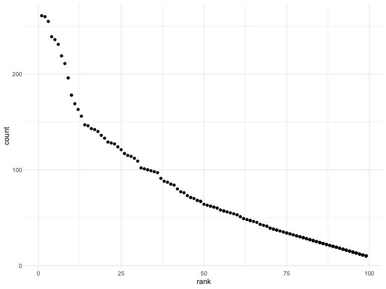

p8105\_hw2\_mp3745
================
Matthew Parker
9/24/2019

# Problem 1

``` r
# Read in Mr. Trash Wheel data sheet, clean names, omit rows without dumpster specific data, round sports_balls to nearest int
mr_trash_data = 
  readxl::read_excel("./data/Trash-Wheel-Collection-Totals-8-6-19.xlsx", 
                     sheet = "Mr. Trash Wheel", 
                     range = "A2:N338") %>% 
  janitor::clean_names() %>%
  filter(!is.na(dumpster)) %>%
  mutate(sports_balls = as.integer(sports_balls))
```

``` r
# Read in 2018 precipitation data
precip_2018_data = 
  readxl::read_excel("./data/Trash-Wheel-Collection-Totals-8-6-19.xlsx", 
                     sheet = "2018 Precipitation", 
                     range = "A2:B14") %>% 
  janitor::clean_names() %>%
  mutate(year = 2018) %>%
  rename("total_precipitation_in" = "total") %>%
  filter(!(is.na(total_precipitation_in))) %>%
  select(year, month, total_precipitation_in)

# Read in 2017 precipitation data
precip_2017_data = 
  readxl::read_excel("./data/Trash-Wheel-Collection-Totals-8-6-19.xlsx", 
                     sheet = "2017 Precipitation", 
                     range = "A2:B14") %>% 
  janitor::clean_names() %>%
  mutate(year = 2017) %>%
  rename("total_precipitation_in" = "total") %>%
  select(year, month, total_precipitation_in)

# Combine 2017 and 2018 precipiation data
precip_2017_18_data = 
  bind_rows(precip_2017_data, precip_2018_data) %>% 
  mutate(month = month.name[month])
```

In the Mr. Trash Wheel data, there a total of 286 observations, whereas
the monthly record of precipitation for 2017 and 2018 combined has a
total of 24 observations. The precipitation dataset consists of monthly
records of the total precipitation in inches. The total amount of
precipitation recorded in 2018 was 70.33 inches. The Mr. Trash Wheel
dataset has dumpster level information regarding what was in each
dumpster that was filled up. It has information about the weight and
volume that was collected into the dumpster, and also counts of various
items, such as sports balls. The median number of sports balls in a
dumpster in 2017 was 8 balls. There is also information about the number
of homes powered by the trash
collected.

# Problem 2

``` r
# Read in and clean the data about the number of national politicians who are democratic or republican at a given time
pols_month_data = 
  read_csv("./data/fivethirtyeight_datasets/pols-month.csv") %>% 
  janitor::clean_names() %>%
  separate(
    col = mon,
    into = c("year", "month", "day"),
    sep = "-"
  ) %>%
  mutate(month = month.name[(as.numeric(month))]) %>%
  mutate(year = as.numeric(year)) %>%
  pivot_longer(
    cols = starts_with("prez"),
    names_to = "president",
    names_prefix = "prez_"
  ) %>%
  select(-value, -day)
```

``` r
# Read in and clean the data about 2 varaibles related to Standard & Poor’s stock market index (S&P)
snp_data = 
  read_csv("./data/fivethirtyeight_datasets/snp.csv") %>% 
  janitor::clean_names() %>%
  separate(
    col = date,
    into = c("month", "day", "year"),
    sep = "/"
  ) %>%
  mutate(month = month.name[(as.numeric(month))]) %>%
  mutate(year = as.numeric(year)) %>%
  select(year, month, close) %>%
  arrange(year, month)
```

``` r
# Read in and clean the data about unemployment
unemploy_data = 
  read_csv("./data/fivethirtyeight_datasets/unemployment.csv") %>% 
  janitor::clean_names() %>%
  pivot_longer(
    cols = jan:dec,
    names_to = "month",
    values_to = "unemployment"
  ) %>%
  mutate(
    month = recode(month, 
                   "jan" = "January",
                   "feb" = "February",
                   "mar" = "March",
                   "apr" = "April",
                   "jun" = "June",
                   "jul" = "July",
                   "aug" = "August",
                   "sep" = "September",
                   "oct" = "October",
                   "nov" = "November",
                   "dec" = "December")
  )
```

``` r
# Merge snp_date into pols_month_data
snp_pols = 
  left_join(pols_month_data, snp_data, by = c("year", "month"))

# Merge unemployment_data into snp_pols
snp_pols_unemploy = 
  left_join(snp_pols, unemploy_data, by = c("year", "month"))
```

There were three datasets imported above. The first dataset
(pols-month), consists of data about the number of politicians who are
democratic or republican at a given time. The second dataset (snp),
consists of data about the closing value of the S\&P stock index on a
given date. The third dataset (unemployment), consists of monthly
recorded unemployment percentage values. The final dataset was a merged
version of the three previously mentioned. This last dataset has 1644
observations of 11 variables. The information was collected from 1947 to
2015 for a total coverage of 68 years. In this dataset, information is
recorded on a monthly basis. The information collected consists of
whether the president at the time was democratic or republican, the
closing value of the S\&P stock index, and the unemployment rate.

# Problem 3

``` r
# Check ethnicity column for name changes of categorical variable
read_csv("./data/Popular_Baby_Names.csv") %>%
  janitor::clean_names() %>% 
  group_by(ethnicity) %>% 
  summarize()
```

    ## # A tibble: 7 x 1
    ##   ethnicity                 
    ##   <chr>                     
    ## 1 ASIAN AND PACI            
    ## 2 ASIAN AND PACIFIC ISLANDER
    ## 3 BLACK NON HISP            
    ## 4 BLACK NON HISPANIC        
    ## 5 HISPANIC                  
    ## 6 WHITE NON HISP            
    ## 7 WHITE NON HISPANIC

From this, it looks like three different ethnicities had changes over
time.

``` r
# Check childs_first_name column for changes in case
read_csv("./data/Popular_Baby_Names.csv") %>%
  janitor::clean_names() %>% 
  group_by(childs_first_name) %>% 
  summarize(
    n = n()
  )
```

    ## # A tibble: 3,021 x 2
    ##    childs_first_name     n
    ##    <chr>             <int>
    ##  1 Aahil                 4
    ##  2 Aaliyah              12
    ##  3 AALIYAH               8
    ##  4 Aarav                 4
    ##  5 AARAV                 4
    ##  6 Aaron                24
    ##  7 AARON                13
    ##  8 Aarya                 3
    ##  9 Aaryan                2
    ## 10 Aayan                 5
    ## # … with 3,011 more rows

It looks like names have changed between being all uppercase and having
only the first letter uppercase

``` r
# Read in baby names data and tidy
baby_data = 
  read_csv("./data/Popular_Baby_Names.csv") %>% 
  janitor::clean_names() %>% 
  mutate(
    childs_first_name = str_to_upper(childs_first_name),
    ethnicity = recode(ethnicity,
      "ASIAN AND PACI" = "ASIAN AND PACIFIC ISLANDER",
      "BLACK NON HISP" = "BLACK NON HISPANIC",
      "WHITE NON HISP" = "WHITE NON HISPANIC"
    )
  ) %>% 
  distinct()
```

``` r
# Table showing the rank of the name "Olivia" over time
baby_data %>% 
  filter(childs_first_name == "OLIVIA") %>% 
  select(year_of_birth, ethnicity, rank) %>%
  arrange(year_of_birth) %>%
  pivot_wider(
    names_from = "year_of_birth",
    values_from = "rank"
  ) %>% 
  knitr::kable(caption = "Rank of the name Olivia by ethnicity across birth years")
```

| ethnicity                  | 2011 | 2012 | 2013 | 2014 | 2015 | 2016 |
| :------------------------- | ---: | ---: | ---: | ---: | ---: | ---: |
| ASIAN AND PACIFIC ISLANDER |    4 |    3 |    3 |    1 |    1 |    1 |
| BLACK NON HISPANIC         |   10 |    8 |    6 |    8 |    4 |    8 |
| HISPANIC                   |   18 |   22 |   22 |   16 |   16 |   13 |
| WHITE NON HISPANIC         |    2 |    4 |    1 |    1 |    1 |    1 |

Rank of the name Olivia by ethnicity across birth years

``` r
# Table showing most popular male names over time
baby_data %>% 
  filter(gender == "MALE", rank == 1) %>% 
  select(year_of_birth, ethnicity, childs_first_name) %>% 
  arrange(year_of_birth) %>% 
  pivot_wider(
    names_from = "year_of_birth",
    values_from = "childs_first_name"
  ) %>% 
  knitr::kable(caption = "Most popular male name by ethnicity across birth years")
```

| ethnicity                  | 2011    | 2012   | 2013   | 2014   | 2015   | 2016   |
| :------------------------- | :------ | :----- | :----- | :----- | :----- | :----- |
| ASIAN AND PACIFIC ISLANDER | ETHAN   | RYAN   | JAYDEN | JAYDEN | JAYDEN | ETHAN  |
| BLACK NON HISPANIC         | JAYDEN  | JAYDEN | ETHAN  | ETHAN  | NOAH   | NOAH   |
| HISPANIC                   | JAYDEN  | JAYDEN | JAYDEN | LIAM   | LIAM   | LIAM   |
| WHITE NON HISPANIC         | MICHAEL | JOSEPH | DAVID  | JOSEPH | DAVID  | JOSEPH |

Most popular male name by ethnicity across birth
years

``` r
# Scatterplot of the number of children with a name against the rank in popularity for that name, among male, white non-hispanic, children born in 2016
baby_data %>% 
  filter(gender == "MALE", ethnicity == "WHITE NON HISPANIC", year_of_birth == 2016) %>% 
  ggplot(aes(x = rank, y = count)) +
  geom_point()
```


